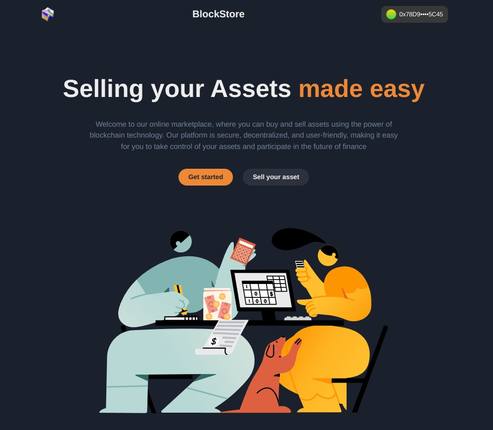
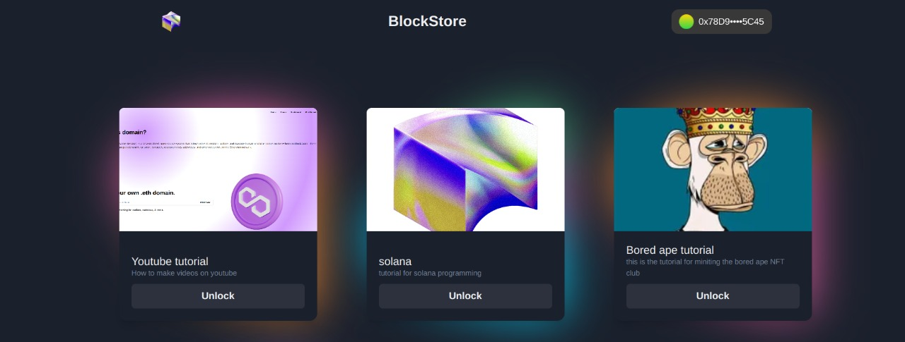
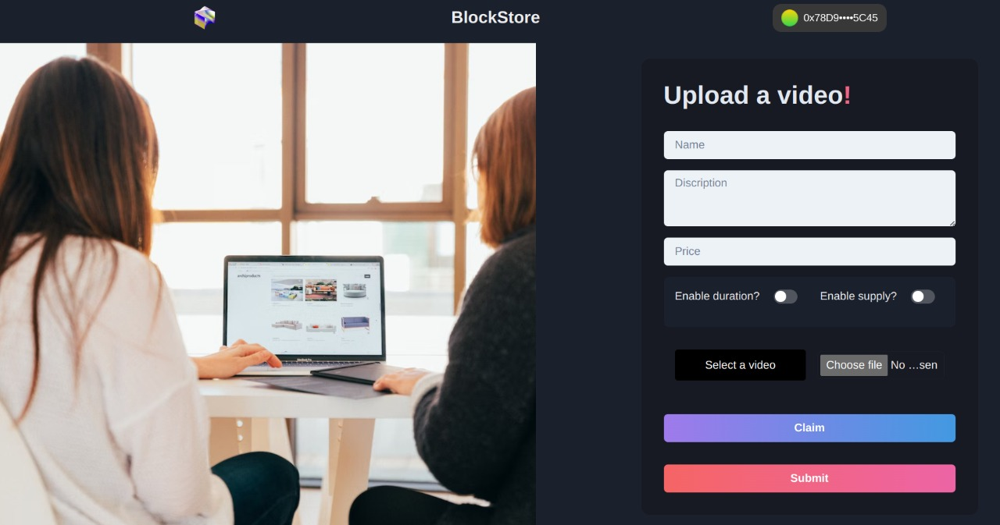
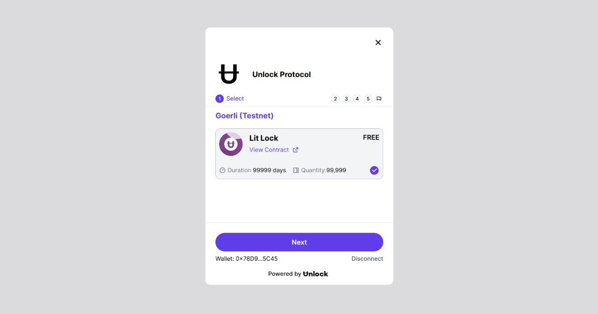

# blockStore
blockStore is an online marketplace for buying and selling digital products only leveraging token-gated access. With blockStore, users can interact with content that is protected by non-fungible tokens, or NFTs. This means that to access a digital product's content, a user must first claim the corresponding NFT. It also provides tools for sellers to list new products for sale leveraging the Orbis SDK. All transactions and access to content on blockStore are recorded on the blockchain, making it easy for users to track their purchases and for sellers to withdraw their profits from their unlock dashboard. 


## Demo
<p float="left">
  
 

   
   
   

</p>

## Prerequisites

The admin user must have Node.js and npm to use this platform. Just download Node.js from [here](https://nodejs.org/en/download/). Every user must have Metamask wallet to sell or buy the products. Checkout how to create Metamask wallet from [here](https://polygon.technology/blog/getting-started-with-metamask-on-polygon).

## Setup Instructions

Clone the repo via CLI:
```sh
git clone https://github.com/Harsh2220/blockStore
cd blockStore
```

Install the required packages:
```sh
npm install 
yarn install   #or
```

In the project directory, you can run:
```sh
npm run dev
yarn dev   #or
```

- Open [http://localhost:3000](http://localhost:3000) to view it in the browser.
