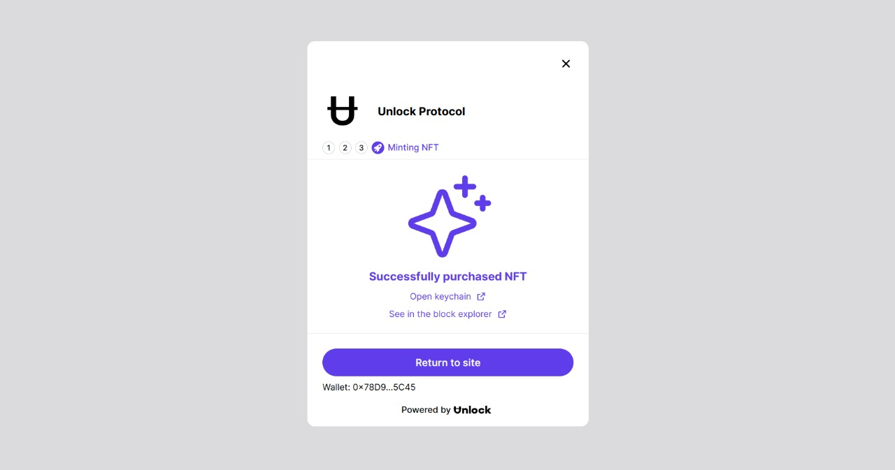

# blockStore
blockStore is an online marketplace for buying and selling digital products only leveraging token-gated access. With blockStore, users can interact with content that is protected by non-fungible tokens, or NFTs. This means that to access a digital product's content, a user must first claim the corresponding NFT. It also provides tools for sellers to list new products for sale leveraging the Orbis SDK. All transactions and access to content on blockStore are recorded on the blockchain, making it easy for users to track their purchases and for sellers to withdraw their profits from their unlock dashboard. 

Our platform is revolutionizing the way content is stored and shared online. By leveraging the power of blockchain technology, we are able to securely and immutably store all types of digital content, from documents and videos to images and audio files. This means that your content is safe, private, and always accessible to you. No more worrying about lost passwords or hacked accounts – with Block Store, you can have peace of mind knowing that your content is stored safely on the blockchain. Plus, our decentralized approach means that there is no central point of control, giving you complete ownership and control over your content. Try us out and see the benefits of storing your content on the blockchain for yourself.

Welcome to our online marketplace, where you can buy and sell assets using the power of blockchain technology. Our platform is secure, decentralized, and user-friendly, making it easy for you to take control of your assets and participate in the future of finance. With Block Store, you can confidently and confidently transact with others without the need for intermediaries. Join us and join the revolution of decentralized asset trading today.

## Demo
<p float="left">
  
 

   
   
   

</p>

## Prerequisites

The admin user must have Node.js and npm to use this platform. Just download Node.js from [here](https://nodejs.org/en/download/). Every user must have Metamask wallet to sell or buy the products. Checkout how to create Metamask wallet from [here](https://polygon.technology/blog/getting-started-with-metamask-on-polygon).

## Setup Instructions

Clone the repo via CLI:
```sh
git clone https://github.com/rkmonarch/blockStore
cd blockStore
```

Install the required packages:
```sh
npm install 
yarn install   #or
```

In the project directory, you can run:
```sh
npm run dev
yarn dev   #or
```

- Open [http://localhost:3000](http://localhost:3000) to view it in the browser.
